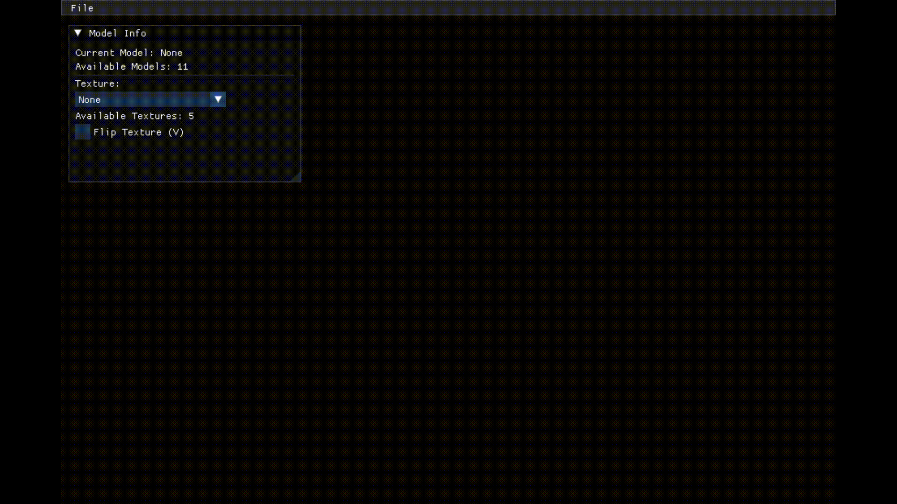

# Scop

OpenGL `.obj` renderer in C++ with an ImGui interface.

## Overview

Scop is a 3D viewer that lets you load OBJ models, navigate the scene with a free camera, and switch the texture applied to the mesh in real time.

The project is built on OpenGL 3.3 Core, with a minimal UI to:

- select a model from `src/models`
- select a texture from `images`
- enable/disable vertical texture flip

## GIFS





## Features

- `.obj` model loading
- `.mtl` material parsing and diffuse texture loading attempt (`map_Kd`)
- automatic fallback to a gray texture when no valid texture is available
- loaded mesh normalization (centering + scaling)
- free camera (keyboard movement + mouse look + wheel zoom)
- runtime wireframe toggle
- automatic model rotation
- ImGui interface for model/texture selection
- fixed 16:9 display ratio
- FPS printed to standard output

## Libraries used

- GLFW: window creation, OpenGL context, keyboard/mouse input
- GLAD: OpenGL function loading
- GLM: math (vectors, matrices, transforms)
- Dear ImGui: debug/control UI
- stb_image: image loading (via `stb_image.h`)

Notes:

- GLAD, GLM, ImGui, and stb are bundled in the repository.
- On Linux, the main external dependency is GLFW (plus OpenGL/Mesa).

## Prerequisites (Linux)

- `make`
- `c++` (C++17)
- OpenGL libraries
- GLFW

Debian/Ubuntu example:

```bash
sudo apt update
sudo apt install -y build-essential make libglfw3-dev libgl1-mesa-dev
```

## Build

From the project root:

```bash
make
```

Generated binary: `./scop`

Useful commands:

- `make`: build
- `make clean`: remove object files
- `make fclean`: remove object files + binary
- `make re`: full rebuild

## Usage

Run:

```bash
./scop
```

In the application:

1. Open the menu bar entry `File > Open Model`
2. Select a detected `.obj` from `src/models`
3. Use the `Model Info` window to change texture
4. Navigate the scene with keyboard/mouse controls

## Keys and controls

### Keyboard

- `ESC`: quit the application
- `W / A / S / D`: move camera
- `SPACE`: move up
- `LEFT SHIFT`: move down
- `V`: enable/disable wireframe mode
- `M`: enable/disable mouse control (cursor capture)
- `R`: enable/disable auto-rotation

### Mouse

- mouse movement (when mouse mode is active): look rotation
- mouse wheel: zoom (FOV)

### UI ImGui

- `File > Open Model`: model selection
- `Texture` (combo): texture selection from `images`
- `None` in texture combo: revert to original MTL texture (or gray fallback)
- `Flip Texture (V)`: vertical UV flip in shader

## Expected asset layout

- OBJ models: `src/models/*.obj`
- associated materials: `src/models/*.mtl`
- replacement textures: `images/*.png`, `images/*.jpg`, `images/*.jpeg`

## Current limitations

- the ImGui texture list currently filters only lowercase `.png`, `.jpg`, `.jpeg`
- model/texture scanning happens at startup
- no drag-and-drop file loading

